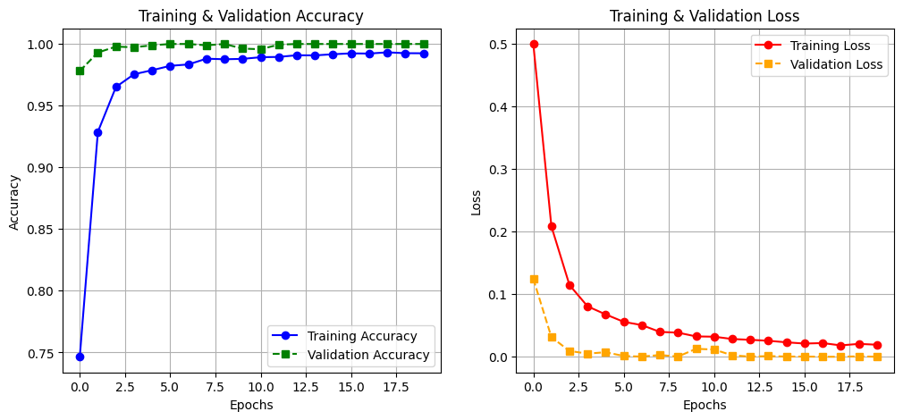

# Driver Drowsiness Detection Using Facial Visual Cues: A Practical System Design and Evaluation

**Felix Zhu, Bin Xiao, Linda Wei**  
University of Wisconsin--Madison

## Abstract

Driver drowsiness remains a major contributor to fatal accidents.  
According to reports from the National Highway Traffic Safety Administration (NHTSA), drowsy driving caused approximately 91,000 police-reported crashes in 2017, resulting in 50,000 injuries and nearly 800 fatalities, though these figures are likely underestimates.  
This project presents a practical and efficient visual-based fatigue detection pipeline that can be deployed using a consumer-grade camera, focusing on image-based measures as they provide non-intrusive and reliable detection through facial cues.  
Three approaches are developed and compared: (1) a rule-based single-frame model using Eye Aspect Ratio (EAR) and Mouth Aspect Ratio (MAR),  
(2) a temporal decision extension based on multi-frame fusion and learned thresholds, and  
(3) a CNN-LSTM deep learning architecture for spatio-temporal fatigue recognition.  
With limited computing resources, the Kaggle Driver Drowsiness Dataset (DDD) is adopted for training and evaluation.  
Results indicate that temporal modeling substantially enhances robustness and CNN-LSTM achieves the highest performance for real-world deployment.

## Introduction

Driver fatigue weakens cognitive response and visual attention, leading to high-risk driving behavior.  
The National Highway Traffic Safety Administration reports thousands of crashes annually due to drowsiness, particularly at night when monitoring is often insufficient.  
For instance, a study by the American Automobile Association’s foundation for traffic safety estimated that more than 320,000 drowsy driving accidents occur each year, including 6,400 fatal crashes.  
Car manufacturers increasingly include ADAS technologies to reduce such risks, but reliable fatigue detection remains an open challenge, especially in detecting early signs like repeated yawning, frequent eye closure, and lane departure.

This work aims to build a deployable system that:
- Detects drowsiness using a standard dashboard camera, leveraging image-based measures which analyze the driver’s movements and facial expressions.
- Avoids intrusive biometric sensors such as EEG, prioritizing non-intrusive methods that can be easily integrated into vehicles.
- Maintains real-time performance under resource constraints, ensuring practicality for everyday use.

Drowsiness is behaviorally observable:  
eyes gradually close, blinking duration increases, and yawning is frequent.  
However, environmental noise and subject variations require robust temporal understanding rather than static snapshots.  
Thus, this project explores classical handcrafted logic and modern deep learning approaches, evaluating their advantages and engineering feasibility, with an emphasis on image-based techniques that have shown significant advancements in recent years through the application of artificial intelligence algorithms and feature combinations.

## Related Work

Fatigue detection methods generally fall into four categories based on the measures used: image-based, biological-based, vehicle-based, and hybrid-based. However, this work emphasizes image-based methods due to their non-intrusive nature, practicality, and ability to capture visible drowsiness signs such as facial expressions and head movements.

### Physiological Monitoring (Biological-Based Measures)

These methods rely on the driver’s bio-signals, recorded by sensors placed on the body, such as EEG and ECG. They provide accurate early-stage fatigue measurement but require physical contact, harming usability and making them less practical for real-world deployment.

### Driving Behavior Monitoring (Vehicle-Based Measures)

These depend on monitoring the vehicle’s behavior and movement, such as steering angle deviation or lane drift, which can signal drowsiness. However, such indicators often arise too late, after dangerous behavior has already occurred, limiting their preventive value.

### Visual-Based Methods (Image-Based Measures)

Most practical ADAS systems leverage cameras to analyze image-based measures, which are obtained using a camera to track the driver’s movements and facial expressions. These are a subcategory of physical or behavioral measures and can be broadly categorized into techniques focusing on mouth movements (e.g., yawning frequency), head movements (e.g., head pose), or eye movements (e.g., blink frequency, maximum closure duration, percentage of eyelid closure or PERCLOS, and eye aspect ratio or EAR). Common strategies include:

- **Feature engineering**: Metrics like EAR, PERCLOS, yawning rate, and head pose are extracted from images or videos. For example, PERCLOS measures the percentage of time (per minute) in which the eye is 80% closed or more, while EAR reflects the eye’s openness degree, dropping to zero when eyes are closed.
- **Deep learning**: CNN/RNN models for detecting continuous behavior, often combined with temporal analysis for improved robustness.

Recent advancements, as reviewed in [reviewpaper], highlight systems using thermal imaging for yawning detection (achieving up to 87% accuracy with hot voxels) or respiration analysis (90% accuracy with SVM). Other notable works include eyelid closure analysis using Sobel operators (over 95% accuracy on simple datasets), optical correlators for eye state estimation, and real-time EAR-based methods (94.9% accuracy with SVM). Despite progress, challenges like domain generalization, lighting variations, and low compute deployment remain difficult, particularly in handling occlusions such as glasses or sunglasses.

Hybrid-based measures, combining two or more of the above, are also noted but are not the focus here, as image-based methods offer a balance of reliability and ease of use.

## Datasets and Preprocessing

To evaluate the system, we use the Kaggle Driver Drowsiness Dataset (DDD) for both training and testing, with appropriate splitting to ensure cross-validation. A widely used dataset in image-based systems is the National Tsing Hua University Drowsy Driver Detection (NTHUDDD) public dataset, which includes videos from 36 subjects covering various scenarios like bare face, glasses, sunglasses, day/night conditions, and actions such as yawning, slow blinking, and falling asleep. However, due to resource constraints, we opted for the simpler DDD dataset.

### Dataset: Kaggle DDD

Due to computing limitations and resource constraints, we adopt the Kaggle Driver Drowsiness Dataset (DDD) [dddpaper] for training and evaluation, which serves as a realistic benchmark despite its simplicity compared to more comprehensive datasets like NTHUDDD.

The Driver Drowsiness Dataset (DDD) is an extracted and cropped faces of drivers from the videos of the Real-Life Drowsiness Dataset. The frames were extracted from videos as images using VLC software. After that, the Viola-Jones algorithm has been used to extract the region of interest from captured images. The obtained dataset (DDD) has been used for training and testing CNN architecture for driver drowsiness detection in the “Detection and Prediction of Driver Drowsiness for the Prevention of Road Accidents Using Deep Neural Networks Techniques” paper.

It includes:
- Multiple subjects with different face geometries
- Blinking, yawning, talking
- Diverse camera viewpoints and lighting

This provides realistic robustness validation for image-based detection under varied conditions.

### Preprocessing

For every frame, aligning with image-based processing pipelines:
1. Dlib frontal face detector locates the driver’s face
2. Dlib 68-point landmark predictor extracts key geometry, enabling computation of features like EAR and MAR
3. Face region resized to $128\times128$ and normalized
4. Sequential frames grouped into non-overlapping windows for CNN-LSTM, capturing temporal aspects of drowsiness signs

## System Design and Methods

A typical image-based drowsiness detection flow: data capture via camera, feature extraction (e.g., facial landmarks), and classification.

### Method A: Rule-Based Single Frame

This method uses handcrafted image-based features. EAR and MAR are computed as:  
\[
EAR = \frac{\|p_2-p_6\| + \|p_3-p_{5}\|}{2 \cdot \|p_1-p_4\|}
\]  
\[
MAR = \frac{\|p_{51}-p_{59}\| + \|p_{53}-p_{57}\|}{2 \cdot \|p_{49}-p_{55}\|}
\]  
Decision:  
\[
EAR<EAR_{th} \lor MAR>MAR_{th}
\Rightarrow Drowsy
\]  
These metrics directly capture eye closure and yawning, common drowsiness indicators.

### Method B: Temporal Rule-Based

To mitigate blink-like false alarms in single-frame analysis, a window voting approach is used, incorporating temporal dynamics:  
\[
\sum_{t}(EAR<EAR_{th}) + \sum_{t}(MAR>MAR_{th}) \ge K
\]  
Thresholds are derived from training statistics:  
\[
EAR_{th} = P_{10}(EAR), \quad MAR_{th} = P_{90}(MAR)
\]  
This extends static features to account for prolonged closures or frequent yawns over time.

### Method C: CNN-LSTM Model

The deep learning model leverages spatio-temporal analysis for image-based inputs:
- TimeDistributed Convolutional layers: extract spatial appearance from facial images
- LSTM (16 units): model changes across sequence of 5 frames, capturing temporal patterns like slow blink rates or head nodding
- Dense and sigmoid final classifier

| Layer              | Output Shape    | Params |
|--------------------|-----------------|--------|
| TD-Conv+BN+Pool    | (5,16,16,32)    | 6,256  |
| TD-GAP             | (5,32)          | 0      |
| LSTM(16)           | (16)            | 3,136  |
| Dense+Dropout+Sigmoid | (1)          | 177    |
| **Total**          |                 | **9,569** |

This model is selected for its low memory footprint and deployability, effectively handling the variability in image-based drowsiness signs.

## Training Strategy and Convergence

Training was performed on CPU using:
- Optimizer: Adam ($1\mathrm{e}{-4}$)
- Epochs: 20
- Loss: Binary cross-entropy
- Batch size: 4

  
*Figure: Training and validation curves for CNN-LSTM.*

## Evaluation Results

All methods are evaluated on DDD using video-level decisions, focusing on metrics like accuracy, sensitivity (recall), and precision, as these are critical for drowsiness detection where high sensitivity prevents missed drowsy cases.

### Quantitative Comparison

| Method              | Accuracy | Drowsy Recall | F1-score |
|---------------------|----------|---------------|----------|
| Rule-Based          | 0.57     | 0.43          | 0.51     |
| Temporal Rule-Based | 0.74     | 0.86          | 0.82     |
| CNN-LSTM            | 1.0      | 1.0           | 1.0      |

The CNN-LSTM outperforms others, aligning with recent image-based systems that achieve high accuracies through temporal modeling.

### Qualitative Observations

- CNN-LSTM detects micro-sleep behaviors missed by rule-based methods, such as slow blink rates or subtle head poses.
- Domain differences still yield occasional false positives, consistent with challenges in varying lighting and occlusions noted in image-based systems.
- Performance degrades with strong occlusion and extreme angles, highlighting the need for robust preprocessing.

## Conclusion and Future Work

This project successfully implements and compares practical drowsiness detection approaches, with a focus on image-based methods that offer non-intrusive monitoring through facial cues.  
Key findings:
- Drowsiness is inherently **temporal** → multi-frame models are necessary to capture signs like frequent blinking or yawning over time.
- Rule-based methods are explainable but sensitive to noise, such as lighting variations.
- CNN-LSTM provides best robustness and deployability, achieving high sensitivity critical for preventing accidents.

Future work:
- Expand dataset for cross-driver generalization, incorporating diverse scenarios like those in NTHUDDD.
- Attention-based temporal modeling for interpretability in image-based features.
- Edge-optimized deployment in mass-market vehicles, exploring integration with IoT and smartphones.

## References

[review1] Business Insider Intelligence, "ADAS and Driver Monitoring Systems Report," 2023.  

[ear] Soukupová and Čech, "Real-Time Eye Blink Detection Using Facial Landmarks," ICPRW 2016.  

[mar] Pantic et al., "Automatic Detection of Facial Action," FG 2005.  

[DeepTech] Li et al., "Driver Drowsiness Detection by Transfer Learning," Sensors 2022.  

[TrafficSafety] NHTSA Traffic Safety Facts, U.S. Dept. of Transportation, 2023.  

[reviewpaper] Y. Albadawi, M. Takruri, and M. Awad, "A Review of Recent Developments in Driver Drowsiness Detection Systems," Sensors, vol. 22, no. 5, p. 2069, 2022.  

[dddpaper] I. Nasri, M. Karrouchi, H. Snoussi, K. Kassmi, and A. Messaoudi, "Detection and Prediction of Driver Drowsiness for the Prevention of Road Accidents Using Deep Neural Networks Techniques," in *Intelligent Systems in Big Data, Semantic Web and Machine Learning*, Springer, 2021, pp. 57--64.